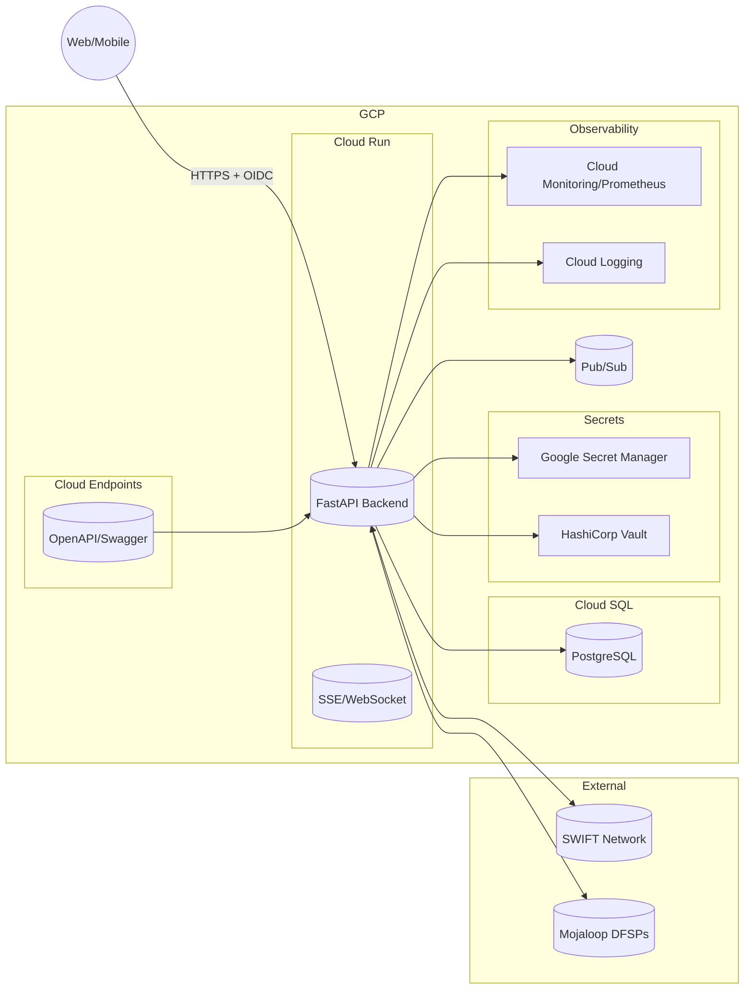

# Architecture

## GCP Diagram (conceptual)

## Services
- Auth Service: Keycloak or Google Identity Platform (OIDC/OAuth2)
- Accounts Service: account metadata, IBAN/BIC validation
- Transfers Service: state orchestration, pacs.008, MT mapping, events
- Connectors Service: SWIFT (AS4/SFTP/REST, mTLS), Mojaloop adapters
- KYC Service: encrypted document storage and screening hooks
- Notifications Service: Pub/Sub -> SSE/WebSocket streaming
- Audit Service: append-only logs with hash chaining
- Observability: Prometheus metrics, Cloud Logging, tracing

## Data
- PostgreSQL managed via Cloud SQL in prod; Flyway migrations in `db/migrations`.