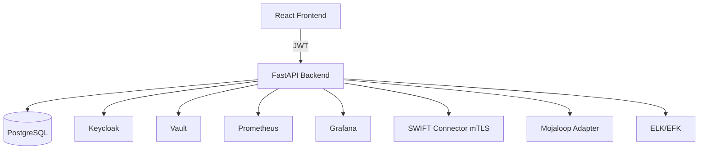

# Architecture & Design

Monolith modulaire (peut évoluer en microservices). Composants:
- Auth (OIDC/Keycloak)
- Accounts
- Transfers (orchestrateur d’état, ISO 20022 pacs.008, mapping MT)
- Connectors (SWIFT, Mojaloop [placeholder])
- KYC (upload chiffré)
- Notifications (SSE)
- Audit (append-only via logs + DB)
- Observabilité (Prometheus/Grafana, logs JSON)

Flux:
1. Frontend React appelle Backend FastAPI avec JWT (RBAC).
2. Création de transfert: validations IBAN/BIC, règles AML (>10k USD -> PENDING/blocked), génération pacs.008, events persistés.
3. Mode dry-run: validation sans envoi; Mode live: envoi via adaptateur SWIFT mTLS.
4. KYC documents chiffrés avec Vault (ou fallback dev AES-GCM).

Diagramme (mermaid):
